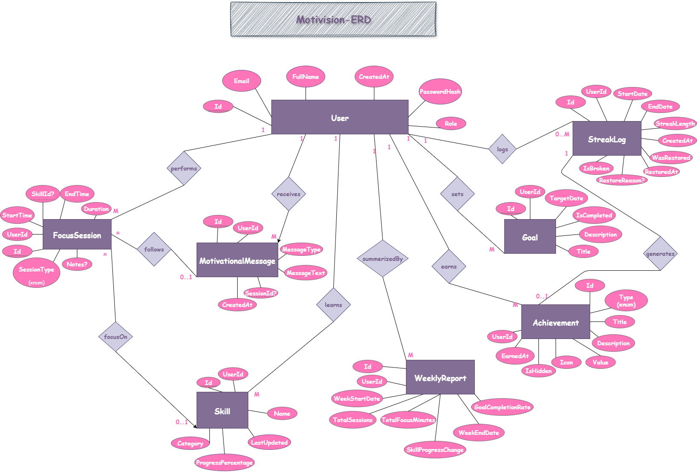
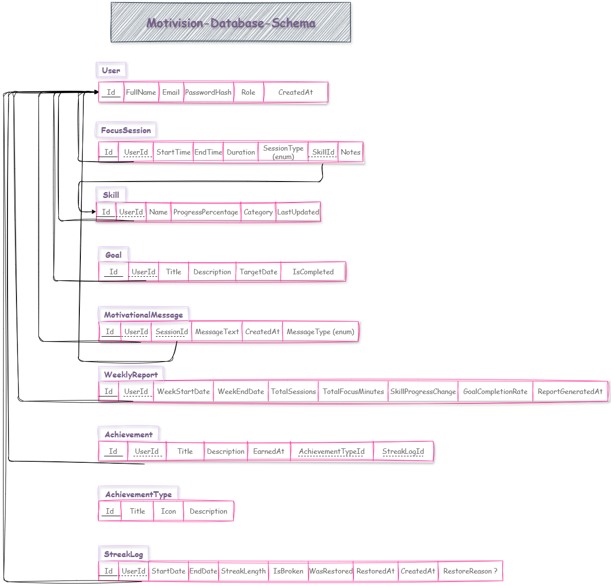

# 🚀 Motivision – Your Smart Motivation Companion

Motivision is a backend system designed to track and enhance user motivation through personalized learning goals, skill progress, and productivity insights.

## 📂 Solution Structure
- **Motivision.Api** – API Layer (Controllers, DTOs, Helpers)
- **Motivision.Application** – Business Logic, Services
- **Motivision.Core** – Domain Models, Contracts, Interfaces
- **Motivision.Infrastructure** – Repositories, Unit of Work, EF Core

## 🗃️ ERD & Schema

 

## 📌 Features
- Users can create personal goals.
- Skills are tracked with progress %.
- Each goal may contain skills and to-do steps.
- Scalable structure for future smart recommendations.

## 🧠 Tech Stack
- ASP.NET Core Web API
- Clean Architecture
- EF Core + Unit of Work + Repositories
- GitHub Workflow (dev ➜ feature branches)

## 👩‍💻 Author
Shahd Soliman – Backend Developer (ASP.NET Core)
